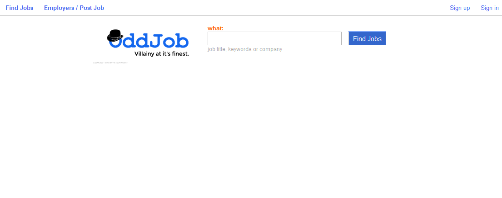
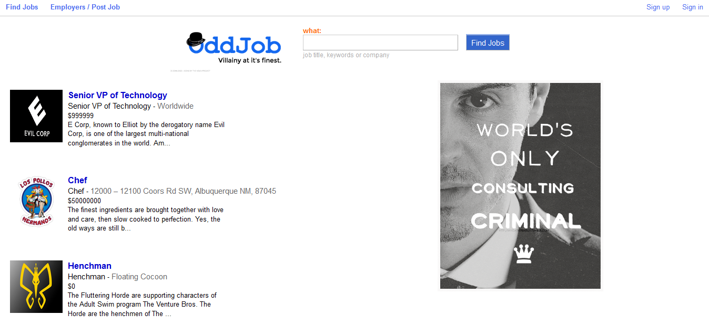

# OddJob

[OddJob live][oddjob]

[oddjob]: http://oddjobappacademy.herokuapp.com

OddJob is a full-stack web application, based on Indeed, for searching and posting jobs. It utilizes Ruby on Rails on the backend, a PostgreSQL database, and React.js with a Flux architectural framework on the frontend.  

###Introduction:

###Search:

## Technical implementation details
- One Page App using React, Flux and React Router
- Both FrontEnd and BackEnd validation for better user feedback and higher security
- Secure Password encryption with Brcypt
- CSRF Authenticity Token enabled
- Log In with facebook with OmniAuth Using OAuth2 Strategy

### Job rendering and editing

  The jobs are stored in one table in the database, which contains columns for `id`, `employer_id`, `description`, 'location' and `salary`.  Upon searching, an API call is made to the database and jobs are filtered by the search parameter.  These jobs are held in the `JobStore` until the user's session is destroyed. When visiting each job individually, checks will be made if the current user was the publisher. This will either allow access to editing/deleting the post or adding the job post to the users watch list under "my job".

###Features
* Sign up/in or sign in with facebook
* create/edit job posting
* add/remove other users' job postings to your "my jobs" watchlist.

###Languages
* JavaScript
* Ruby
* SQL
* HTML
* CSS

###Frameworks

* React.js
* Rails

###Libraries and Technologies

* BCrypt
* Flux
* jQuery
* Paperclip
* PgSearch
* PostgreSQL
* Facebook-OmniAuth
* React Router
* Webpack

###To-Do:
* [ ] Refine search parameters
* [ ] Edit MyJobs by status
* [ ] Pagination / infinite scroll for Jobs/Myjobs Index
* [ ] Sort by group (i.e. location, salary, job type)

[Original Design Docs](./docs/README.md)
